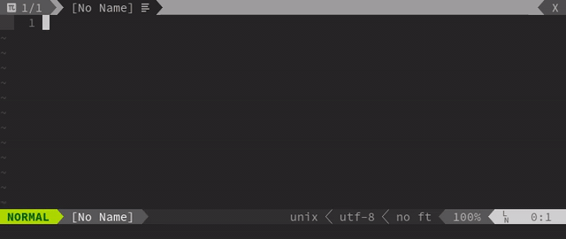

# Vim Adaptative Indent


This is a **very** small plugin (It's really just a 13 lines function).  
It allows to automatically detect the indent used in a file by the use of the following command:
```vim
:AdaptIndent
```

This will look for the first satisfying indent in the file, and apply it to your VIM settings. It works both with tab indents and spaces indent. See GIF bellow:


